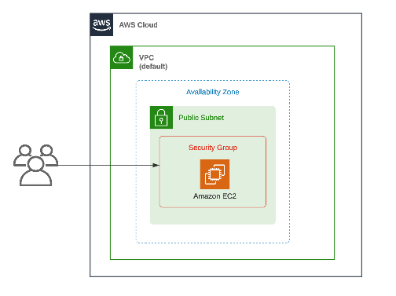

# 1-  Launching a PHP Web Server on AWS 

In this project we will create an EC2 instance that runs a php web application 

## OverView

This project provisions a simple web server environment on Amazon Web Services (AWS) using Terraform. It launches an EC2 instance that runs a PHP web application, associated with a security group that allows inbound traffic on port 80 and outbound traffic to any destination. The instance is tagged with a random pet name generated by Terraform and runs a user-data script to install and configure software or applications.

## Limitaions 

### 1-Scalability :
   The current infrastructure is designed for small scale application and may not be suitable for large,high traffic web apps

### 2- High availability : 
   This infra is consisted of only one EC2 instance , wich can be a single point of failure, If this instance goes down, your web application will become unavailable

