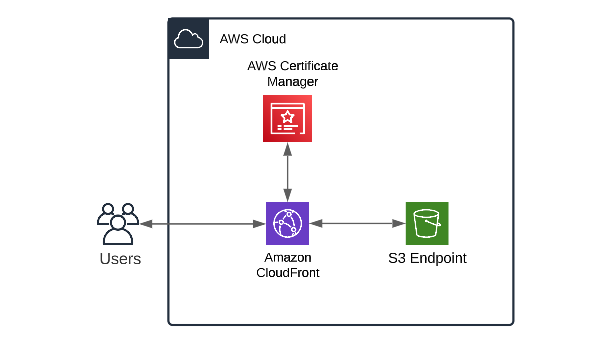

# 2-Launching a static website using S3 and CloudFront 
   
   This project aims to launch a static website by using S3 to store the static files , CloudFront to serve the content globally and AWS Certificate Manager for HTTPS encryption 

## OverView

